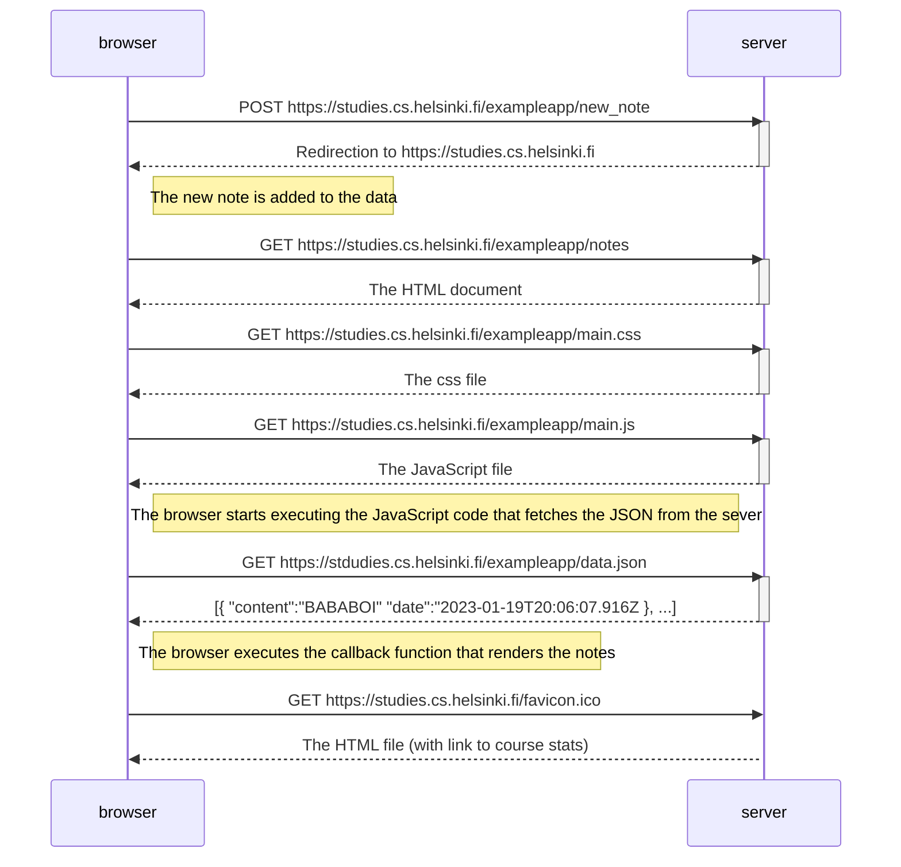

```mermaid
	sequenceDiagram
		participant browser
		participant server
		browser->>server: POST https://studies.cs.helsinki.fi/exampleapp/new_note
		activate server
		server-->>browser: Redirection to https://studies.cs.helsinki.fi
		deactivate server
		Note right of browser: The new note is added to the data
		
		browser->>server: GET https://studies.cs.helsinki.fi/exampleapp/notes
		activate server
		server-->>browser: The HTML document
		deactivate server
	
		browser->>server: GET https://studies.cs.helsinki.fi/exampleapp/main.css
		activate server
		server-->>browser: The css file
		deactivate server
	
		browser->>server: GET https://studies.cs.helsinki.fi/exampleapp/main.js
		activate server
		server-->>browser: The JavaScript file
		deactivate server

		Note right of browser: The browser starts executing the JavaScript code that fetches the JSON from the sever
	
		browser->>server: GET https://stdudies.cs.helsinki.fi/exampleapp/data.json
		activate server
		server-->>browser: [{ "content":"BABABOI" "date":"2023-01-19T20:06:07.916Z }, ...]
		deactivate server
		
		Note right of browser: The browser executes the callback function that renders the notes
		
		browser->>server: GET https://studies.cs.helsinki.fi/favicon.ico
		activate server
		server-->>browser: The HTML file (with link to course stats)
```