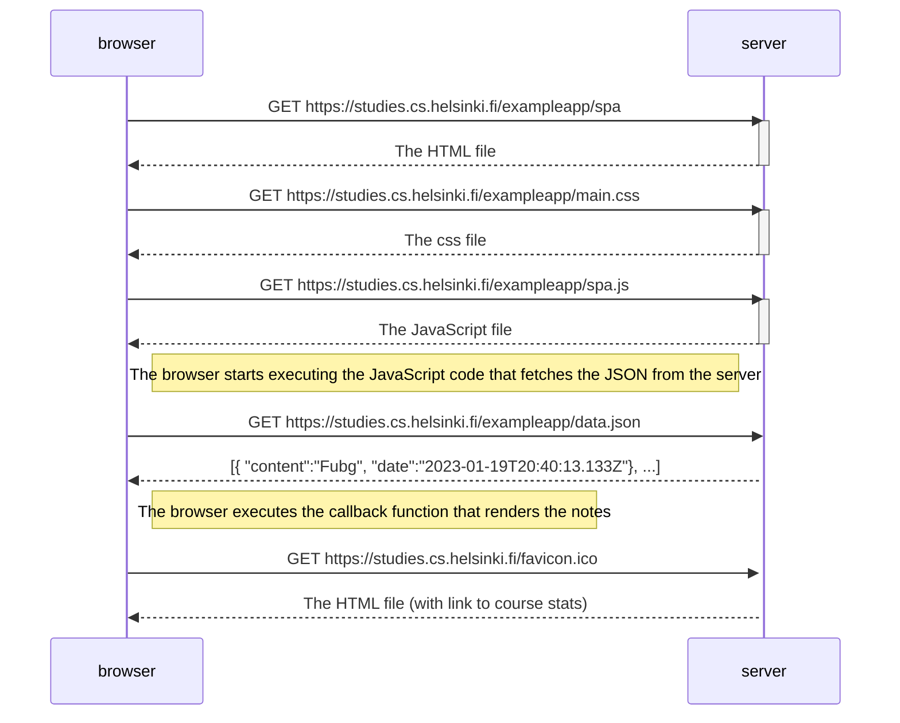

```mermaid
	sequenceDiagram
		participant browser
		participant server
		browser->>server: GET https://studies.cs.helsinki.fi/exampleapp/spa
		activate server
		server-->>browser: The HTML file
		deactivate server

		browser->>server: GET https://studies.cs.helsinki.fi/exampleapp/main.css
		activate server
		server-->>browser: The css file
		deactivate server

		browser->>server: GET https://studies.cs.helsinki.fi/exampleapp/spa.js
		activate server
		server-->>browser: The JavaScript file
		deactivate server

		Note right of browser: The browser starts executing the JavaScript code that fetches the JSON from the server
	
		browser->>server: GET https://studies.cs.helsinki.fi/exampleapp/data.json
		activate server
		server-->>browser: [{ "content":"Fubg", "date":"2023-01-19T20:40:13.133Z"}, ...]

		Note right of browser: The browser executes the callback function that renders the notes

		browser->>server: GET https://studies.cs.helsinki.fi/favicon.ico
		activate server
		server-->>browser:The HTML file (with link to course stats)
```